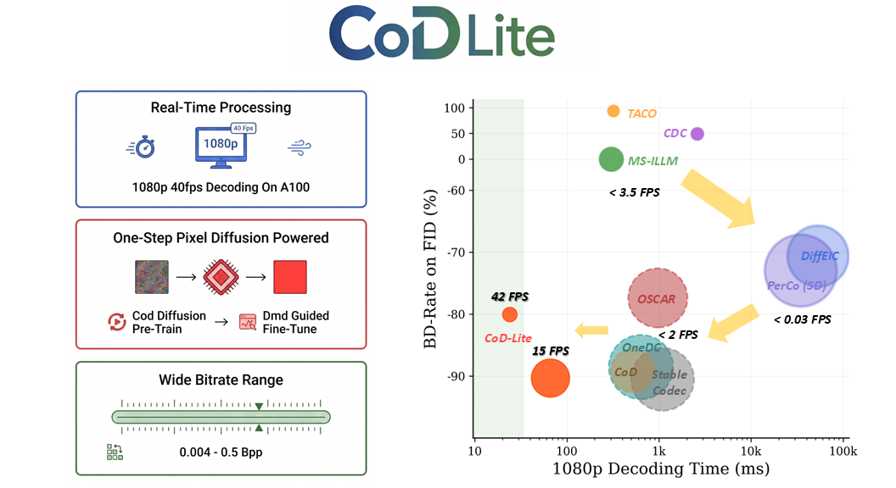
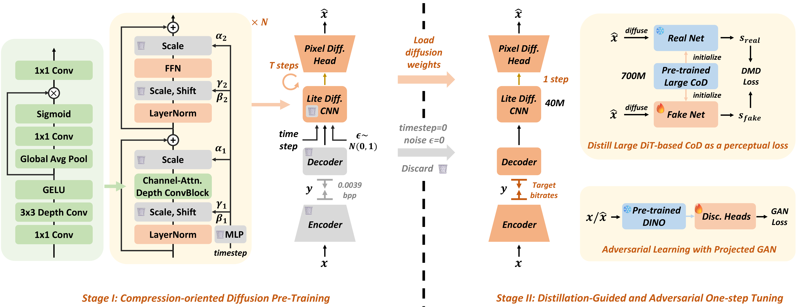
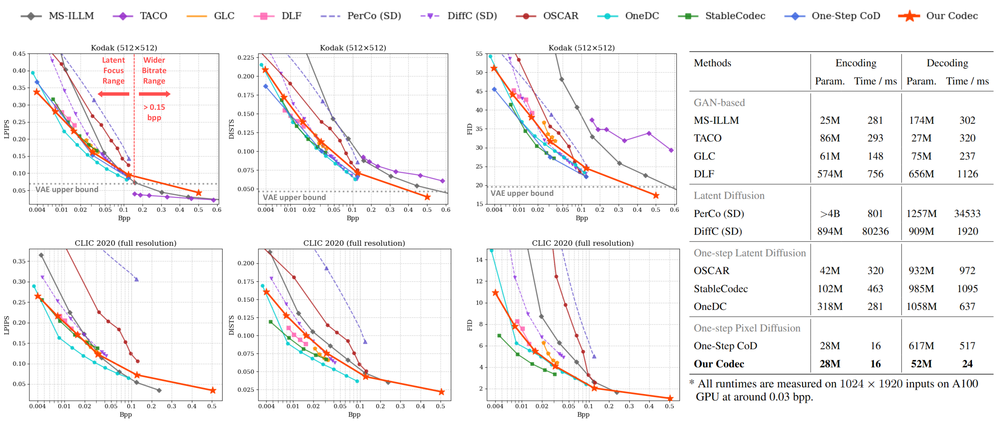

<h2 align="center">CoD-Lite: Real-Time Diffusion-Based Generative Image Compression</h2>

<p align="center">
  <a href="https://arxiv.org/abs/TODO"></a>
  <a href="https://huggingface.co/zhaoyangjia/CoD_Lite"></a>
</p>

---

## 📖 Introduction

**CoD-Lite** is a real-time, lightweight convolutional diffusion-based image codec. Unlike prior diffusion codecs that rely on billion-parameter foundation models and multi-step sampling, CoD-Lite achieves competitive perceptual quality with a compact architecture (28M encoder + 52M decoder) and one-step decoding, enabling **60 FPS encoding** and **42 FPS decoding** at 1080p on a single A100 GPU.

<p align="center">
  
</p>

## ✨ Key Insights for Real-Time Coding

For real-time performance:

1. **Light 52M decoder**, which is orders of magnitude smaller than existing diffusion codecs.
2. **Convolutional diffusion** to replace time-consuming DiTs.
3. **Pixel-space diffusion** to avoid VAE decoding. 
4. **One-step diffusion** to avoid iterative sampling.

For maintaining the compression quality:

1. **Compression-oriented diffusion pre-training** ([CoD](../CoD)) is uniquely effective for lightweight models.
3. **Distillation-guided and adversarial one-step fine-tuning** to significantly improve performance.

<p align="center">
  
</p>

## 🏆 Performance

### Model List

All models are hosted on [Hugging Face](https://huggingface.co/zhaoyangjia/CoD_Lite).

**Pre-trained CoD-Lite**

| Model | Checkpoint |
|:------|:----------:|
| CoD-Lite (pre-trained) | [`CoD_Lite_pretrain.pt`](https://huggingface.co/zhaoyangjia/CoD_Lite/blob/main/CoD_Lite_pretrain.pt) |

**One-Step Codec at Various Bitrates**

| BPP | Downsampling | Codebook Bits | Config | Checkpoint |
|:---:|:------------:|:-------------:|:------:|:----------:|
| 0.0039 | 32x | 4 | [`CoD_Lite_bpp_0_0039.yaml`](https://huggingface.co/zhaoyangjia/CoD_Lite/blob/main/CoD_Lite_bpp_0_0039.yaml) | [`CoD_Lite_bpp_0_0039.pt`](https://huggingface.co/zhaoyangjia/CoD_Lite/blob/main/CoD_Lite_bpp_0_0039.pt) |
| 0.0078 | 32x | 8 | [`CoD_Lite_bpp_0_0078.yaml`](https://huggingface.co/zhaoyangjia/CoD_Lite/blob/main/CoD_Lite_bpp_0_0078.yaml) | [`CoD_Lite_bpp_0_0078.pt`](https://huggingface.co/zhaoyangjia/CoD_Lite/blob/main/CoD_Lite_bpp_0_0078.pt) |
| 0.0156 | 16x | 4 | [`CoD_Lite_bpp_0_0156.yaml`](https://huggingface.co/zhaoyangjia/CoD_Lite/blob/main/CoD_Lite_bpp_0_0156.yaml) | [`CoD_Lite_bpp_0_0156.pt`](https://huggingface.co/zhaoyangjia/CoD_Lite/blob/main/CoD_Lite_bpp_0_0156.pt) |
| 0.0312 | 16x | 8 | [`CoD_Lite_bpp_0_0312.yaml`](https://huggingface.co/zhaoyangjia/CoD_Lite/blob/main/CoD_Lite_bpp_0_0312.yaml) | [`CoD_Lite_bpp_0_0312.pt`](https://huggingface.co/zhaoyangjia/CoD_Lite/blob/main/CoD_Lite_bpp_0_0312.pt) |
| 0.1250 | 8x | 8 | [`CoD_Lite_bpp_0_1250.yaml`](https://huggingface.co/zhaoyangjia/CoD_Lite/blob/main/CoD_Lite_bpp_0_1250.yaml) | [`CoD_Lite_bpp_0_1250.pt`](https://huggingface.co/zhaoyangjia/CoD_Lite/blob/main/CoD_Lite_bpp_0_1250.pt) |
| 0.5000 | 4x | 8 | [`CoD_Lite_bpp_0_5000.yaml`](https://huggingface.co/zhaoyangjia/CoD_Lite/blob/main/CoD_Lite_bpp_0_5000.yaml) | [`CoD_Lite_bpp_0_5000.pt`](https://huggingface.co/zhaoyangjia/CoD_Lite/blob/main/CoD_Lite_bpp_0_5000.pt) |

### Rate-Distortion Curves

<p align="center">
  
</p>

CoD-Lite outperforms GAN-based and multi-step diffusion codecs across most metrics, and achieves competitive quality with state-of-the-art one-step diffusion codecs while delivering **at least 20x faster decoding**. Quantitatively, our method achieves approximately **85% bit savings** on FID compared to MS-ILLM.

### Coding Speed

All runtimes measured at 0.0312 bpp.

| Device | 720x480 (Enc/Dec) | 1920x1024 (Enc/Dec) | 3840x2160 (Enc/Dec) |
|:-------|:-----------------:|:-------------------:|:-------------------:|
| NVIDIA A100 GPU | 6 / 13 ms | 16 / 24 ms | 63 / 75 ms |
| NVIDIA RTX 2080Ti GPU | 9 / 21 ms | 46 / 47 ms | 200 / 208 ms |
| AMD EPYC 9V84 CPU | 58 / 65 ms | 287 / 202 ms | 1343 / 837 ms |

### Visual Comparison

<p align="center">
  
</p>


## 🔧 Installation

### Setup

```bash
git clone https://github.com/microsoft/GenCodec.git
cd GenCodec/CoD_Lite
conda create -n cod_lite python=3.12
conda activate cod_lite
pip install -r requirements.txt

# for training only
bash scripts/setup_train.sh
```

### Download Checkpoints

```bash
# Download all models
huggingface-cli download zhaoyangjia/CoD_Lite --local-dir ./pretrained/CoD_Lite

# Or download specific bitrate models
huggingface-cli download zhaoyangjia/CoD_Lite CoD_Lite_bpp_0_0312.pt CoD_Lite_bpp_0_0312.yaml --local-dir ./pretrained/CoD_Lite
```

## 🚀 Inference

The inference CLI has three subcommands: `compress`, `decompress`, and `evaluate`.

### Compress

Encode images into `.cod` bitstreams:

```bash
python -m finetuned_one_step_codec.inference compress \
    --ckpt ./pretrained/CoD_Lite/CoD_Lite_bpp_0_0312.pt \
    --config ./pretrained/CoD_Lite/CoD_Lite_bpp_0_0312.yaml \
    --input <image_dir> \
    --output <bitstream_dir>
```

### Decompress

Decode `.cod` bitstreams back to images:

```bash
python -m finetuned_one_step_codec.inference decompress \
    --ckpt ./pretrained/CoD_Lite/CoD_Lite_bpp_0_0312.pt \
    --config ./pretrained/CoD_Lite/CoD_Lite_bpp_0_0312.yaml \
    --input <bitstream_dir> \
    --output <recon_dir>
```

### End-to-End Evaluate

Compress and decompress in a single pass:

```bash
python -m finetuned_one_step_codec.inference evaluate \
    --ckpt ./pretrained/CoD_Lite/CoD_Lite_bpp_0_0312.pt \
    --config ./pretrained/CoD_Lite/CoD_Lite_bpp_0_0312.yaml \
    --input <image_dir> \
    --output <recon_dir>
```

### Arguments

| Argument | Type | Default | Description |
|:---------|:----:|:-------:|:------------|
| `mode` | str | — | `compress`, `decompress`, or `evaluate` |
| `--ckpt` | str | — | Path to model checkpoint |
| `--config` | str | — | Path to YAML config file |
| `--input` | str | — | Input directory (images or `.cod` files) |
| `--output` | str | — | Output directory |

### Supported Bitrates

| BPP | Downsampling | Codebook Bits |
|:---:|:------------:|:-------------:|
| 0.0039 | 32x | 4 |
| 0.0078 | 32x | 8 |
| 0.0156 | 16x | 4 |
| 0.0312 | 16x | 8 |
| 0.1250 | 8x | 8 |
| 0.5000 | 4x | 8 |


## 🏋️ Training

### Data Preparation

CoD-Lite uses the same datasets as in [CoD](../CoD/scripts/prepare_datasets/README.md).

### Diffusion Pre-training

The pre-training pipeline has three stages with automatic checkpoint chaining:

```bash
python entry_train_cod.py \
    --data_dir <data_dir> \
    --save_dir <save_dir> \
    --exp_name my_experiment \
    --bpp 0_0039
```

| Stage | Resolution | Batch Size | Max Steps | Description |
|:-----:|:---------:|:----------:|:---------:|:------------|
| 1 | 256×256 | 128 | 600K | Low-resolution pre-training |
| 2 | 512×512 | 64 | 100K | High-resolution pre-training |
| 3 | 512×512 | 64 | 50K | Unified post-training |

> Total pre-training cost: ~284 A100 GPU hours (~12 A100 days). The launcher auto-detects GPUs and adjusts per-GPU batch size with gradient accumulation.


### One-Step Codec Fine-tuning

Fine-tune the pre-trained CoD into a one-step codec at target bitrates. This requires the pre-trained CoD checkpoint (`CoD_Lite_pretrain.pt`) and the CoD base model as DMD teacher:

```bash
# Download the pre-trained CoD model (optional: you can also pre-train from scratch)
huggingface-cli download zhaoyangjia/CoD_Lite CoD_Lite_pretrain.pt --local-dir ./pretrained/CoD_Lite

# Download the CoD base model (DMD teacher for stage 2)
huggingface-cli download zhaoyangjia/CoD --include "cod/CoD_pixel_vpred.*" --local-dir ./pretrained/CoD

# Fine-tune at target bitrate
python entry_finetune_cod_lite.py \
    --data_dir <data_dir> \
    --save_dir <save_dir> \
    --exp_name my_experiment \
    --bpp 0_0312 \
    --cod_ckpt ./pretrained/CoD_Lite/CoD_Lite_pretrain.pt \
    --dmd_ckpt ./pretrained/CoD/cod/CoD_pixel_vpred.pt
```

| Stage | Max Steps | Batch Size | Description |
|:-----:|:---------:|:----------:|:------------|
| 1 | 200K | 16 | Reconstruction fine-tuning (L1 + LPIPS + feature alignment) |
| 2 | 200K | 32 | Distillation + adversarial fine-tuning (DMD + projected GAN) |

> Fine-tuning cost per bitrate: ~244 A100 GPU hours (~10 A100 days). DINOv2 weights default to the path installed by `scripts/setup_train.sh`.


## 📊 Evaluation

Compute image quality metrics between reference and reconstructed images:

```bash
python scripts/metric.py \
    --ref <reference_dir> \
    --recon <reconstruction_dir> \
    --device cuda:0 \
    --fid_patch_size 64 \
    --output_path <output_dir> \
    --output_name my_experiment
```

**Supported metrics:** PSNR, LPIPS (AlexNet), DISTS, FID. `fid_patch_size` is set to 64 for Kodak512 and 256 for other datasets.

> FID uses patch-based computation ([Mentzer et al., 2020](https://arxiv.org/abs/2006.09965)) for stable evaluation on small high-resolution datasets.


## 📝 Citation

If you find this work useful, please consider citing:

```bibtex
@article{jia2026codlite,
    title     = {Real-Time Diffusion-Based Generative Image Compression},
    author    = {Jia, Zhaoyang and Xue, Naifu and Zheng, Zihan and Li, Jiahao and Li, Bin and Zhang, Xiaoyi and Guo, Zongyu and Zhang, Yuan and Li, Houqiang and Lu, Yan}
}
```
